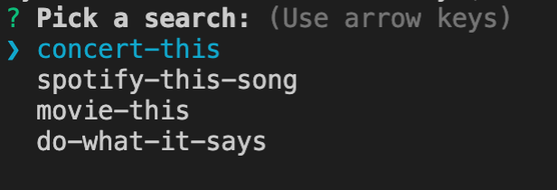
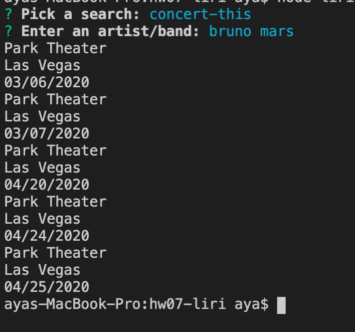
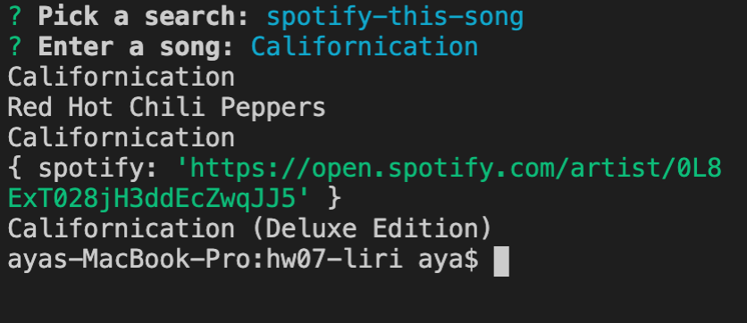
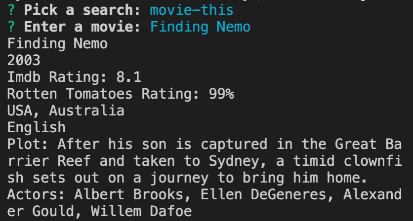
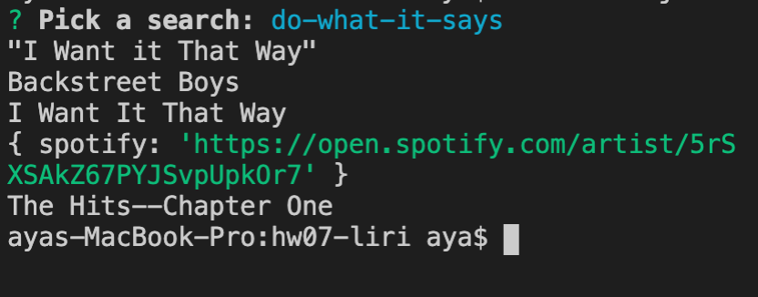

# LIRI Bot

GitHub Link: https://github.com/aya828/hw07-liri

LIRI, a language interpretation and recognition interface, is a command line node app that takes in the parameters and gives back data. Users can choose between "concert-this", "spotify-this-song", "movie-this", and "do-what-it-says".

"concert-this": Enter an artist to see upcoming concerts, venue names, city, and date.

"spotify-this-song": Enter a song and the app will pull up artist and song info, including an external spotify URL.

"movie-this": Enter a movie title and the movie title, year, ratings, actors, plot, etc. will appear.

"do-what-it-says": Choosing this option will pull text from a random text file and follow its command.

By using the LIRI Bot app, users can easily search concerst, songs, and movies to get all the information they need, all in one app.

Technologies used: Dotenv, Spotify, Axios, Inquirer, Moment